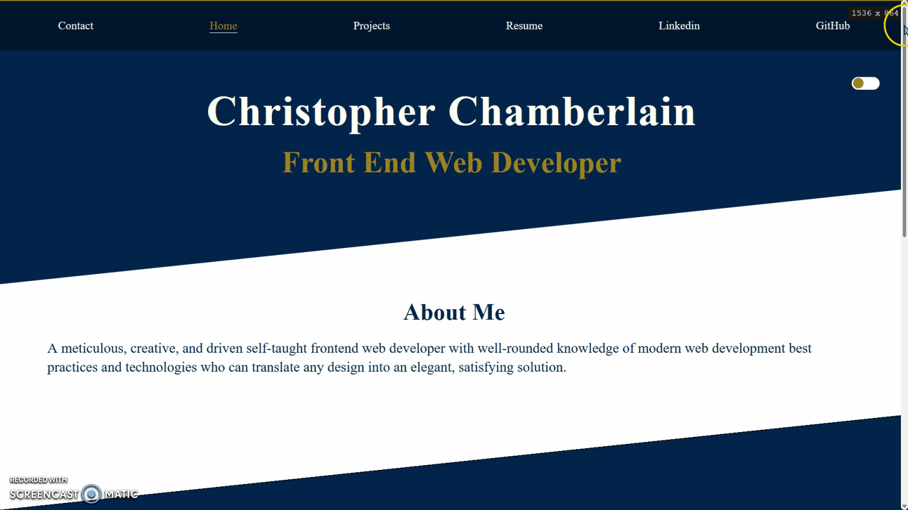
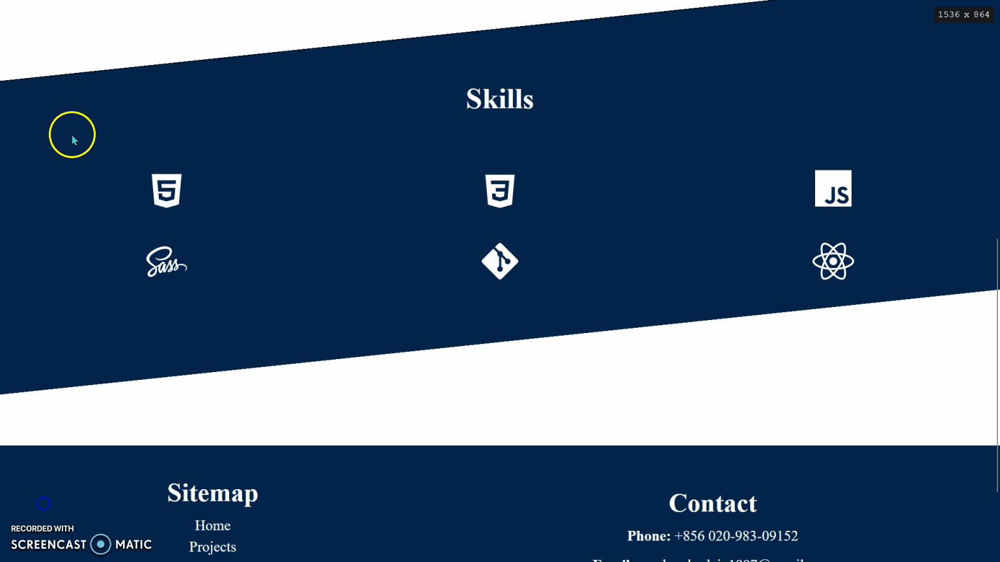
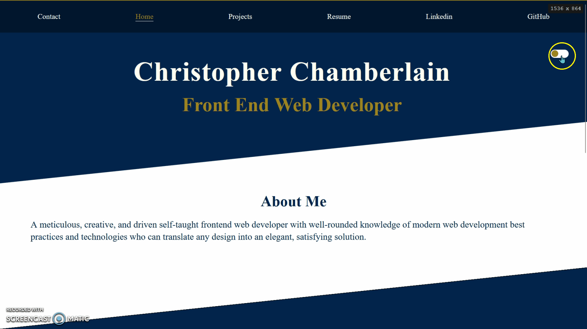

# Site works best in Firefox.

# Why? 🤔
- This is my first professional portfolio site. It took me weeks of daily devlopment to finish it. It is the biggest, most complex, and most challenging independent project I've worked on so far. It's also my first independant React.JS project. Every step of the way was a challenge and a learning curve - from React Router being updated and having to learn how to use the newest version to figuring out how to link to external websites. Therefore, this has been one of the most enriching projects that I've done.

---

# Laguages Used 💬
- React.JS
- SCSS

---

# Features ⚙

## Site Overview 🧐

## Fully Responsive UI

## Skills Section with Tooltip Hover Effect

## Light / Dark Theme Toggle

## Entrance and Exit Animations on Page Change

## Custom Built Project Display Gallery

---

# What I learned? 👨‍💻
- How to link to external pages in Create React App
- How to use React Router 6 to setup site navigation
- How to add theme toggle functionality
- How to use Framermotion to add animation 
- How to use ::before and ::after pseudo-elements to create asymmetrical shapes
- How to use Tippy package to add tooltips to elements
- How to conditionally render page title based on route
- How to deploy Create React Apps on Netlify
